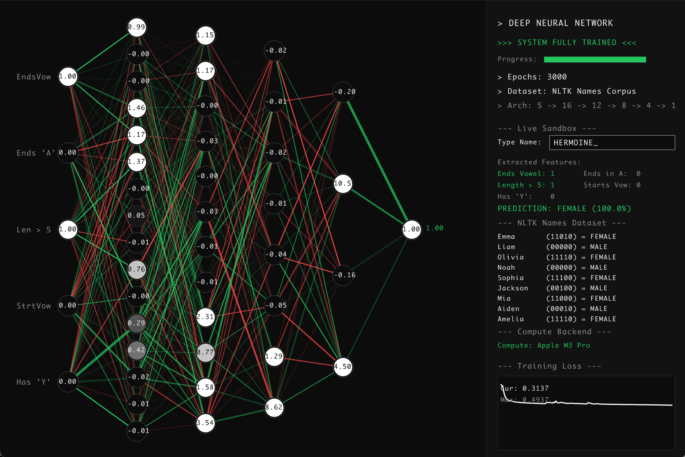
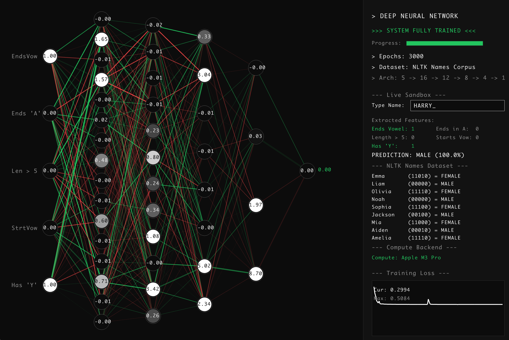

  <h1>Neural-C</h1>
  
<strong>A C-based Deep Neural Network library and visualizer, highly optimized for macOS.</strong>

  

    
    
    
  

---

## Table of Contents
- [About the Project](#about-the-project)
- [Features](#features)
- [Screenshots](#screenshots)
- [OS Compatibility](#os-compatibility)
- [Documentation](#documentation)
- [License](#license)
- [Author](#author)

## About the Project
Neural-C features a custom multilayer perceptron (MLP) built from scratch in C, and leverages Apple's Metal framework for GPU-accelerated forward propagation. A built-in graphical visualizer allows for real-time monitoring of the network's training process and structure.

## Features
- **Pure C Neural Network**: Forward and backward propagation implemented in standard C.
- **Metal GPU Backend**: Computations offloaded to macOS GPU for maximum performance.
- **Real-time Visualization**: Interactive visualization of weights, biases, and loss history using Raylib.
- **Dynamic Feature Extraction**: Real-time evaluation of inputs directly in the UI.

## Screenshots

  
  &nbsp;
  

## OS Compatibility
> **macOS Only**: This project is exclusively built for macOS. It relies heavily on Apple's native **Metal API** (`metal_backend.m`, `shaders.metal`) for hardware-accelerated matrix operations. It will not compile or run on Windows or Linux without removing or mocking the Metal backend.

## Documentation
For a complete breakdown of the code, the libraries used, and architectural decisions, please refer to our [documentation](docs/documentation.md).

## License
Distributed under the MIT License. See [`LICENSE`](LICENSE) for more information.

## Author
Created by **Piyush Parashar**.
