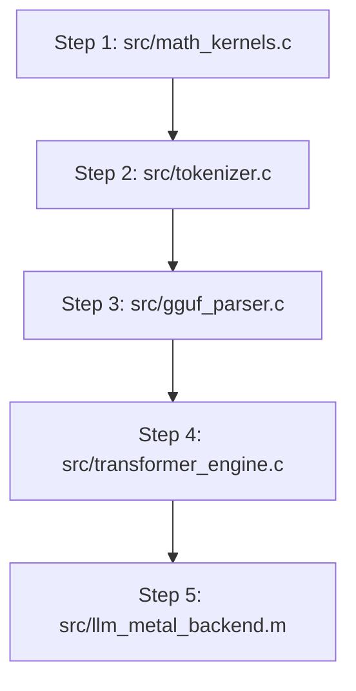

# Neural-C: Beginner's Educational Study Guide

> Learn how Large Language Models (LLMs) work down to the byte level in pure C and Metal, without Python, PyTorch, or complex libraries.

---

## 1. The Big Picture: How an LLM Works

Imagine you are reading a book and guessing the **next word** in a sentence.

```
Prompt: "Once upon a _______"
Model Guess: "time" (98.4% confidence)
```

A Large Language Model (LLM) is a pattern-matching calculator. It converts text to numbers, performs matrix calculations across layers, and outputs probabilities for every possible next word in its vocabulary.

```
===================================================================================
THE 4 STEPS OF LLM INFERENCE
===================================================================================
Step 1: TOKENIZATION   ---> Convert text prompt into Token ID numbers
Step 2: EMBEDDING      ---> Look up dense float vectors for each Token ID
Step 3: TRANSFORMER    ---> Pass vectors through Layers & Self-Attention
Step 4: SAMPLING       ---> Select highest probability next word via Softmax
===================================================================================
```

---

## 2. Deep Dive into Core Concepts

### 2.1 Tokenization (Text to Numbers)
Computers process numbers, not raw text characters.

- **Vocabulary**: A dictionary of subwords (e.g., 32,000 to 151,936 entries for models like LLaMA-3 or Qwen2.5-Coder).
- **Token ID**: The integer position of a subword in the dictionary.
- **BPE Byte Representation**: Modern models (like Qwen2.5 / Tiktoken) encode spaces as `Ġ` (`0xC4 0xA0`) and newlines as `Ċ` (`0xC4 0x8A`). Neural-C dynamically translates these bytes to human-readable text and extracts special token IDs (`bos_token_id`, `eos_token_id`, `padding_token_id`) directly from GGUF metadata.

```
"Once"  ---> Token ID: 7120
" upon" ---> Token ID: 3208
" a"    ---> Token ID: 263
```

---

### 2.2 Token Embeddings
A single integer like `7120` does not capture the semantic meaning of a word. The model represents each word as a vector of floating-point numbers (e.g., 288 dimensions):

```
"king"   = [  0.82, -0.45,  0.91,  0.12, ... ]
"queen"  = [  0.81, -0.42,  0.89,  0.95, ... ]  (High similarity)
"apple"  = [ -0.12,  0.88, -0.34, -0.67, ... ]  (Low similarity)
```

---

### 2.3 Self-Attention Mechanism
In the sentence: *"The monkey ate the **banana** because **it** was ripe."*, how does the computer know **"it"** refers to the **banana**?

Self-attention allows words to interact across context:
1. Every word generates a **Query** ($Q$) ("What information am I looking for?").
2. Every previous word generates a **Key** ($K$) ("What information do I contain?").
3. Multiplying $Q \times K^T$ produces attention relevance scores:

```
Relevance Scores for "it":
  - "banana": 85%  (Primary match)
  - "monkey": 14%  (Secondary match)
  - "The"   :  1%  (Negligible match)
```

---

## 3. C Memory & Pointer Basics

### 3.1 Pointers (`float*`)
A pointer stores a physical memory address rather than a raw value.

```c
float price = 10.5f;   // 4-byte float holding value 10.5
float* ptr = &price;   // 'ptr' holds the memory address of 'price'
```

### 3.2 Contiguous Memory Layout
Vector elements reside sequentially in contiguous memory blocks, optimizing CPU cache prefetching:

```
Address:    0x1000       0x1004       0x1008       0x100C
Memory:  +------------+------------+------------+------------+
         |   0.82f    |  -0.45f    |   0.91f    |   0.12f    |
         +------------+------------+------------+------------+
Pointer:   ptr          ptr + 1      ptr + 2      ptr + 3
```

---

## 4. Codebase Study Roadmap



| Source File | Functionality | Primary Concepts |
| :--- | :--- | :--- |
| `src/math_kernels.c` | Vector & Quantization Math | RMSNorm, Softmax, RoPE, `Q4_0` GEMV |
| `src/tokenizer.c` | Subword Encoding & Decoding | Byte-Pair Encoding (BPE), String Tables |
| `src/gguf_parser.c` | Model Loading | POSIX `mmap`, Header Validation |
| `src/transformer_engine.c` | Main Forward Pass Loop | Multi-Head Attention, SwiGLU, Residuals |
| `src/llm_metal_backend.m` | GPU Acceleration | Apple Metal Compute Pipelines, MSL Shaders |
