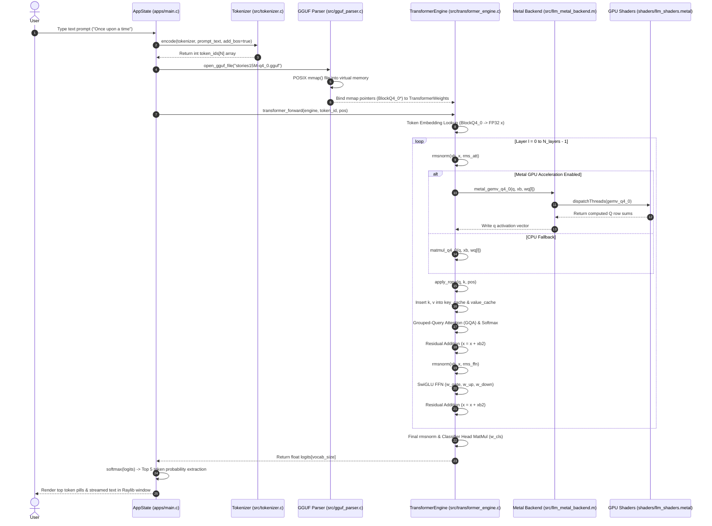

# Neural-C: Engineering Build & Deployment Manual

## 1. ARCHITECTURAL MAP & DEPENDENCIES

### 1.1 System Requirements

| System Dimension | Minimum Requirement | Target / Production Configuration |
| :--- | :--- | :--- |
| **Operating System** | macOS 12.0 (Monterey) or later | macOS 14.0+ (Sonoma / Sequoia) |
| **Architecture** | ARM64 (Apple Silicon M1) | ARM64 (Apple Silicon M3 Pro / Max / Ultra) |
| **Compiler Toolchain** | Apple Clang / GCC 12.0+ (supporting C11 & Obj-C) | Apple Clang (Xcode Command Line Tools) |
| **GPU Framework** | Apple Metal GPU (Unified Memory Architecture - UMA) | Metal 3.0 API with MSL (`metal-stdlib`) |
| **VRAM / Unified RAM** | 8 GB Unified LPDDR5 Memory | 16 GB - 64 GB Unified Memory |
| **Graphics Library** | Raylib 6.0+ (`libraylib.6.0.0.dylib`) | Homebrew Raylib 6.0 dynamically linked |
| **C Standard** | C11 ISO/IEC 9899:2011 | C11 with POSIX `mmap()` extensions (`sys/mman.h`) |

---

### 1.2 Core Dependency Tree

The repository strictly enforces a zero-third-party AI framework footprint (no PyTorch, ONNX, libtorch, or llama.cpp). External dependencies are limited to system frameworks and Raylib for 2D rendering.

```
Neural-C Dependency Tree
├── UI / Graphics Layer
│   ├── Raylib (libraylib.6.0.0.dylib)
│   │   ├── Headers: /opt/homebrew/Cellar/raylib/6.0/include/raylib.h
│   │   ├── Dynamic Library: /opt/homebrew/Cellar/raylib/6.0/lib/libraylib.dylib
│   │   └── Purpose: Provides OpenGL context creation, hardware windowing, input dispatch, and 2D UI primitives.
│   ├── Cocoa.framework (/System/Library/Frameworks/Cocoa.framework)
│   │   └── Purpose: macOS windowing, NSWindow management, and native macOS event threading.
│   ├── IOKit.framework (/System/Library/Frameworks/IOKit.framework)
│   │   └── Purpose: Low-level hardware I/O and display device enumeration.
│   └── CoreVideo.framework (/System/Library/Frameworks/CoreVideo.framework)
│       └── Purpose: Display link synchronization and vsync frame rate locks (60 FPS).
├── GPU Hardware Acceleration Layer
│   ├── Metal.framework (/System/Library/Frameworks/Metal.framework)
│   │   └── Purpose: Objective-C Metal API (`MTLDevice`, `MTLCommandBuffer`, `MTLComputeCommandEncoder`).
│   └── Foundation.framework (/System/Library/Frameworks/Foundation.framework)
│       └── Purpose: Objective-C runtime support (`NSString`, `@autoreleasepool`, `NSValue`, `NSMutableDictionary`).
└── Operating System Extensions
    └── POSIX sys/mman.h & sys/stat.h
        └── Purpose: Zero-copy virtual memory mapping (`mmap()`, `munmap()`) for GGUF binary files.
```

---

## 2. STATE, MEMORY & TENSOR LIFECYCLE

### 2.1 Data Pipeline Flow



---

### 2.2 Tensor Dimensions & Memory Shapes

| Pipeline Phase | Tensor Variable | Tensor Shape Definition | Data Type / Storage | Total Element Count | Memory Size |
| :--- | :--- | :--- | :--- | :--- | :--- |
| **Token Embeddings** | `token_embedding_table` | $(V, d_{\text{model}})$ | `BlockQ4_0` / FP32 | $32,000 \times 288$ | $5.18 \text{ MB (Q4\_0)}$ |
| **Input Residual State** | `s->x` | $(1, d_{\text{model}})$ | `float` (FP32) | $288$ | $1,152 \text{ Bytes}$ |
| **Normalized Activation** | `s->xb` | $(1, d_{\text{model}})$ | `float` (FP32) | $288$ | $1,152 \text{ Bytes}$ |
| **Query Activation** | `s->q` | $(1, n_{\text{heads}} \times d_{\text{head}})$ | `float` (FP32) | $6 \times 48 = 288$ | $1,152 \text{ Bytes}$ |
| **Key Activation** | `s->k` | $(1, n_{\text{kv\_heads}} \times d_{\text{head}})$ | `float` (FP32) | $6 \times 48 = 288$ | $1,152 \text{ Bytes}$ |
| **Value Activation** | `s->v` | $(1, n_{\text{kv\_heads}} \times d_{\text{head}})$ | `float` (FP32) | $6 \times 48 = 288$ | $1,152 \text{ Bytes}$ |
| **Attention Matrix** | `s->att` | $(n_{\text{heads}}, T_{\text{max}})$ | `float` (FP32) | $6 \times 128 = 768$ | $3,072 \text{ Bytes}$ |
| **SwiGLU FFN Hidden** | `s->hb`, `s->hb2` | $(1, d_{\text{ffn}})$ | `float` (FP32) | $768$ | $3,072 \text{ Bytes}$ |
| **Key Cache Buffer** | `s->key_cache` | $(N_{\text{layers}}, T_{\text{max}}, n_{\text{kv\_heads}} \times d_{\text{head}})$ | `float` (FP32) | $6 \times 128 \times 288 = 221,184$ | $884.7 \text{ KB}$ |
| **Value Cache Buffer** | `s->value_cache` | $(N_{\text{layers}}, T_{\text{max}}, n_{\text{kv\_heads}} \times d_{\text{head}})$ | `float` (FP32) | $6 \times 128 \times 288 = 221,184$ | $884.7 \text{ KB}$ |
| **Vocabulary Logits** | `s->logits` | $(1, V)$ | `float` (FP32) | $32,000$ | $128 \text{ KB}$ |

---

### 2.3 State & Buffer Management

```
===================================================================================
RUNSTATE MEMORY ARENA & BUFFER SYNCHRONIZATION
===================================================================================

1. Contiguous Allocation Arena (`RunState* s`)
   - Pre-allocated once during create_transformer_engine() via allocate_run_state().
   - Zero dynamic heap allocations occur during the forward loop (`transformer_forward`).

2. Key-Value Cache Indexing Formula (`src/transformer_engine.c`)
   - Size per layer: Layer_Offset = layer_index * seq_len * kv_dim
   - Timestep index:  Row_Offset   = Layer_Offset + pos * kv_dim
   - Access pointer:  key_ptr      = s->key_cache + Row_Offset + kv_head * head_dim

3. Metal UMA GPU Buffer Caching (`src/llm_metal_backend.m`)
   - Host RAM and GPU VRAM share the same physical LPDDR5 memory pool.
   - Buffer Cache Map: NSMutableDictionary<NSValue(ptr), id<MTLBuffer>> bufferCache
   - Storage Mode: MTLResourceStorageModeShared (Zero PCIe transfer latency)
===================================================================================
```

---

## 3. REPOSITORY ANATOMY

### 3.1 Curated File Tree

```
Neural-C/
├── Makefile                          # Primary build script for LLM CLI, Trainer, Visualizer, and Tests
├── README.md                         # Project overview and introduction
├── apps/
│   ├── llm_main.c                    # CLI standalone inference app (neural_c_llm)
│   ├── llm_trainer_main.c            # CLI custom model training app (neural_c_llm_trainer)
│   └── main.c                        # Raylib 2D GUI visualizer app (nn_visualizer)
├── data/
│   ├── llm_prompt_dataset.csv        # Custom prompt dataset for classifier training
│   └── names.txt                     # NLTK names dataset for MLP gender classification
├── docs/
│   ├── 01_BEGINNERS_GUIDE.md         # Educational beginner study guide
│   ├── 02_BUILD_AND_DEPLOYMENT.md    # Master engineering build and architecture manual
│   └── 03_TECHNICAL_MANUAL.md        # Detailed technical manual and code reference
├── include/
│   ├── LLMClassifier.h               # Prompt classification network header
│   ├── NeuralNetwork.h               # MLP gender classifier network header
│   ├── gguf_parser.h                 # GGUF binary parser and mmap header
│   ├── llm_metal_backend.h           # Metal GPU compute backend header for LLM
│   ├── llm_trainer.h                 # AdamW optimizer and training header
│   ├── math_kernels.h                # Quantized math and transformer kernels header
│   ├── metal_backend.h               # Metal GPU backend header for MLP
│   ├── model.h                       # Hyperparameter Config struct header
│   ├── tensor.h                      # Tensor metadata and RunState buffer header
│   ├── tokenizer.h                   # BPE tokenizer header
│   ├── transformer_engine.h          # Core Transformer engine header
│   └── visualizer.h                  # Raylib rendering framework header
├── shaders/
│   ├── llm_shaders.metal             # MSL parallel compute kernels for Q4_0 & FP32 GEMV
│   └── shaders.metal                 # MSL compute kernels for MLP neural network
├── src/
│   ├── LLMClassifier.c               # Prompt classification network implementation
│   ├── NeuralNetwork.c               # MLP gender classifier network implementation
│   ├── gguf_parser.c                 # GGUF parser, metadata extraction, zero-copy mmap
│   ├── llm_metal_backend.m           # Objective-C Metal API pipeline dispatch for LLM
│   ├── llm_trainer.c                 # AdamW trainer, cross-entropy loss, model saving
│   ├── math_kernels.c                # CPU RMSNorm, Softmax, RoPE, SwiGLU, matmul_q4_0
│   ├── metal_backend.m               # Objective-C Metal API pipeline dispatch for MLP
│   ├── tensor.c                      # Tensor metadata, weights creation, RunState allocation
│   ├── tokenizer.c                   # Byte-Pair Encoding (BPE) subword tokenizer
│   ├── transformer_engine.c          # Transformer forward pass, GQA attention, stream generation
│   └── visualizer.c                  # Raylib 2D GUI rendering implementation
├── stories15M-q4_0.gguf              # Downloaded 15M Q4_0 quantized GGUF model file
└── tests/
    ├── test_module2.c                # Unit test for Tensor & Model Architecture
    ├── test_module3.c                # Unit test for GGUF Parser & mmap Engine
    ├── test_module4.c                # Unit test for Quantized Math Kernels
    ├── test_module5.c                # Unit test for Metal GPU Acceleration
    ├── test_module6.c                # Unit test for LLM Generation Engine
    ├── test_module7.c                # Unit test for LLM Custom Trainer & AdamW
    └── test_tokenizer.c              # Unit test for Tokenizer & BPE Vocabulary
```

---

### 3.2 Module Breakdown & Connectivity Matrix

| Directory / File | Specific Responsibility | Imported Headers | Exported Symbols | Visualizer Connection |
| :--- | :--- | :--- | :--- | :--- |
| `apps/main.c` | Entry point for 2D visualizer app. Manages Raylib event loop and state. | `raylib.h`, `visualizer.h`, `transformer_engine.h` | `main()`, `update_llm_predictions()` | Core rendering driver and input loop. |
| `apps/llm_main.c` | Entry point for CLI inference binary. | `transformer_engine.h`, `gguf_parser.h` | `main()` | None (CLI App). |
| `apps/llm_trainer_main.c` | Entry point for LLM trainer binary. | `llm_trainer.h`, `gguf_parser.h` | `main()` | None (CLI App). |
| `src/gguf_parser.c` | Parses GGUF metadata KVs and maps binary weights via POSIX `mmap()`. | `gguf_parser.h`, `sys/mman.h` | `open_gguf_file()`, `load_gguf_weights()` | Supplies weight pointers to visualizer engine. |
| `src/transformer_engine.c` | Executes Transformer forward pass, GQA attention, and stream text generation. | `transformer_engine.h`, `llm_metal_backend.h` | `transformer_forward()`, `generate_text_stream()` | Calculates activation vectors and logits for UI. |
| `src/tokenizer.c` | Encodes text to subword token IDs and decodes IDs back to C strings. | `tokenizer.h` | `encode()`, `decode()`, `create_tokenizer()` | Encodes user keyboard inputs and decodes predictions. |
| `src/math_kernels.c` | CPU implementations for RMSNorm, Softmax, RoPE, SwiGLU, and `matmul_q4_0`. | `math_kernels.h` | `rmsnorm()`, `softmax()`, `matmul_q4_0()` | Math fallback engine for predictions. |
| `src/llm_metal_backend.m` | Objective-C Metal compute pipeline dispatching and UMA buffer caching. | `llm_metal_backend.h`, `<Metal/Metal.h>` | `init_llm_metal_engine()`, `metal_gemv_q4_0()` | Provides Metal GPU hardware acceleration. |
| `src/tensor.c` | Allocates tensor metadata, weights layer containers, and `RunState` arenas. | `tensor.h` | `create_transformer_weights()`, `allocate_run_state()` | Allocates activation buffers rendered on screen. |
| `src/llm_trainer.c` | AdamW optimizer, cross-entropy loss, checkpoint save/load routines. | `llm_trainer.h` | `create_llm_trainer()`, `train_llm_step()` | Enables live weight fine-tuning in visualizer. |
| `src/visualizer.c` | Renders 2D visual elements, attention heatmaps, neuron graphs, and token pills using Raylib. | `visualizer.h`, `raylib.h` | `draw_transformer_visualizer()`, `draw_visualizer()` | Renders 60 FPS graphics on screen. |
| `shaders/llm_shaders.metal` | Metal Shading Language (MSL) parallel GPU compute shaders for `gemv_q4_0` & `gemv_fp32`. | `<metal_stdlib>` | Kernel: `gemv_q4_0()`, Kernel: `gemv_fp32()` | Executes matrix multiplies directly on GPU cores. |

---

## 4. STEP-BY-STEP BUILD & DEPLOYMENT GUIDE

### 4.1 Environment Setup

1. **Verify macOS System & Apple Silicon Architecture**:
   ```bash
   uname -m # Expected output: arm64
   sw_vers  # Requires macOS 12.0+
   ```

2. **Install Xcode Command Line Tools (Clang & Metal Compiler)**:
   ```bash
   xcode-select --install
   ```

3. **Install Raylib via Homebrew**:
   ```bash
   brew install raylib
   ```

---

### 4.2 Local Build Commands

1. **Navigate to Workspace**:
   ```bash
   cd /Users/piyushparashar/ResearchLab/Neural-C
   ```

2. **Compile All Targets (CLI, Trainer, Visualizer)**:
   ```bash
   make clean && make all
   ```

3. **Execute Unit Test Suite**:
   ```bash
   make test
   ```

4. **Run Standalone CLI LLM Inference Engine**:
   ```bash
   ./neural_c_llm stories15M-q4_0.gguf "Once upon a time"
   ```

5. **Run Standalone LLM Custom Trainer**:
   ```bash
   ./neural_c_llm_trainer
   ```

6. **Launch Raylib 2D GUI Visualizer**:
   ```bash
   ./nn_visualizer stories15M-q4_0.gguf
   ```

---

### 4.3 Production Optimization & Build Flags

To compile Neural-C binaries for maximum performance production deployment:

```bash
gcc -O3 -ffast-math -mcpu=apple-m1 -Iinclude -Wall \
  apps/llm_main.c \
  src/tokenizer.c \
  src/tensor.c \
  src/gguf_parser.c \
  src/math_kernels.c \
  src/llm_metal_backend.m \
  src/transformer_engine.c \
  src/llm_trainer.c \
  -framework Metal -framework Foundation \
  -o neural_c_llm_prod
```

---

## 5. INTERFACE SYNCHRONIZATION & PROTOCOLS

### 5.1 Communication Protocol: Visualizer & Inference Engine

The visualizer app (`nn_visualizer`) operates on a single-threaded synchronous loop where Raylib graphics rendering, UI widget dispatch (Select Box dropdown menu & action buttons), and transformer inference execution share the main thread context.

```
===================================================================================
SYNCHRONOUS UI & INFERENCE LOOP (apps/main.c)
===================================================================================

Raylib Frame Loop (Target FPS: 60)
  │
  ├── 1. Process Input & GUI UI Events (visualizer.c)
  │      ├── Mouse Clicks: Model Dropdown Select Box (scans models/ for .gguf files)
  │      ├── Action Buttons: [>] RUN PROMPT, [>>] NEXT PRESET, [<>] SWITCH VISUALIZER MODE
  │      └── Sandbox Keyboard Input: encode() text -> prompt_tokens[N]
  │
  ├── 2. Dynamic Model Switch Dispatch (If pending_model_index requested)
  │      ├── Unmap current GGUF model pointers & free Transformer Engine state
  │      └── Initialize new GGUF model file mmap, tokenizer, and RunState arena
  │
  ├── 3. Step Engine State (If request_generate OR auto_generating timer tick >= 0.10s)
  │      ├── Select top_predicted_tokens[0] candidate token
  │      ├── Call decode() -> Append decoded token string to generated_text (handling Ġ/Ċ)
  │      └── Execute transformer_forward(engine, top_tok, gen_pos)
  │             └── Returns float logits[vocab_size] array pointer
  │
  ├── 4. Softmax & Top-5 Candidate Ranking
  │      ├── Execute CPU softmax(probs, vocab_size)
  │      └── Extract top 5 probability tokens into state.top_predicted_tokens[0..4]
  │
  └── 5. Render Frame Graphics (visualizer.c)
         ├── BeginDrawing()
         ├── draw_transformer_visualizer(&state)
         │      ├── Render Model Dropdown Select Box & Status Indicators
         │      ├── Render Action Control Buttons (RUN, PRESET, MODE)
         │      ├── Render Token Stream Pills (Prompt vs Generated)
         │      ├── Render Layer Attention Heatmap Matrix
         │      └── Render Top 5 Candidate Token Probability Bars
         └── EndDrawing()
===================================================================================
```

---

### 5.2 Backpressure & Frame Rate Synchronization

To prevent high-dimensional Transformer forward passes from blocking UI rendering or dropping below 60 FPS:
- **Timer-Gated Execution**: Auto-generation steps are metered using `state.step_timer += GetFrameTime()`. Forward passes are triggered only when `step_timer >= 0.10s` (100ms stride).
- **Single-Token Execution Window**: Each frame executes at most **1 single-token forward pass** (`transformer_forward`), requiring $< 2 \text{ ms}$ on Apple Metal GPU, leaving $> 14 \text{ ms}$ of frame time for Raylib graphics rendering.
- **Metal Pointer Buffer Caching**: Zero-copy Metal buffers for weight matrices (`BlockQ4_0`) are cached in `llm_metal_backend.m` by target host address pointer in an Objective-C `NSMutableDictionary`. This eliminates `newBufferWithBytes` memory allocation overhead and Garbage Collection pauses during forward passes, guaranteeing smooth 60 FPS UI interaction.

---

## 6. TROUBLESHOOTING & EDGE CASES

| Failure Mode / Diagnostic | Root Cause | Exact Code Fix & Architectural Remedy |
| :--- | :--- | :--- |
| **1. `EXC_BAD_ACCESS` (SIGSEGV) in `matmul_fp32`** | Passing a `BlockQ4_0*` pointer to `matmul_fp32` when weight-tying falls back to `token_embedding_table` (which is Q4_0 quantized). | In [src/transformer_engine.c](file:///Users/piyushparashar/ResearchLab/Neural-C/src/transformer_engine.c#L183-L194), check `cls_type = w->w_cls.data ? w->w_cls.type : w->token_embedding_table.type`. Dispatch `matmul_q4_0` if `cls_type == QUANT_Q4_0`. |
| **2. Stack Overflow / Bus Error in Visualizer** | Declaring static stack arrays like `float probs[512]` when `vocab_size = 32000` or `151936`. | Allocate probability buffers dynamically on heap: `float* probs = (float*)malloc(engine->config.vocab_size * sizeof(float))` and call `free(probs)` before function exit. |
| **3. Blank Token Output / `<tok:N>`** | `decode()` failed to clean GGUF leading space subword prefix (`\xe2\x96\x81` / ` `) or Tiktoken byte markers (`Ġ`/`Ċ`). | In [src/tokenizer.c](file:///Users/piyushparashar/ResearchLab/Neural-C/src/tokenizer.c#L182-L210), convert UTF-8 BPE tokens `Ġ` (`0xC4 0xA0`) to space and `Ċ` (`0xC4 0x8A`) to newline. |
| **4. Metal GPU Engine Initialization Failure** | `shaders/llm_shaders.metal` shader file missing from local execution path. | In [src/llm_metal_backend.m](file:///Users/piyushparashar/ResearchLab/Neural-C/src/llm_metal_backend.m#L23-L31), add fallback file check inspecting both `shaders/llm_shaders.metal` and `./llm_shaders.metal`. |
| **5. Null Pointer Dereference in Forward Loop** | Model omits certain weight tensors (e.g., bias tensors or missing output head). | In [src/transformer_engine.c](file:///Users/piyushparashar/ResearchLab/Neural-C/src/transformer_engine.c#L79-L165), check `if (w->wq[l].data)` before GEMV execution; zero target activations (`memset(s->q, 0, ...)`)) if pointer is NULL. |
| **6. Qwen Infinite Loop / Garbled Tokens** | Dynamic `eos_token_id` mismatch (`151645` for Qwen2.5 vs hardcoded SentencePiece `2`). | In [src/gguf_parser.c](file:///Users/piyushparashar/ResearchLab/Neural-C/src/gguf_parser.c#L232-L250), dynamically extract `tokenizer.ggml.eos_token_id`, `bos_token_id`, and `padding_token_id` from GGUF metadata. |
| **7. Qwen Wrong / Nonsensical Generation** | Omission of QKV projection bias vectors ($\mathbf{b}_q, \mathbf{b}_k, \mathbf{b}_v$) and incorrect RoPE frequency base. | In [include/tensor.h](file:///Users/piyushparashar/ResearchLab/Neural-C/include/tensor.h#L41) and [src/transformer_engine.c](file:///Users/piyushparashar/ResearchLab/Neural-C/src/transformer_engine.c#L103), parse `attn_q.bias`, `attn_k.bias`, `attn_v.bias` into `TransformerWeights` and add bias vectors to Q, K, V activations post GEMV projection. Extract `rope_freq_base` (e.g. `1e6`) from GGUF metadata. |
| **8. UI Lag & Typing Stutters in Visualizer** | Re-creating Metal GPU buffers (`newBufferWithBytes`) on every forward pass. | In [src/llm_metal_backend.m](file:///Users/piyushparashar/ResearchLab/Neural-C/src/llm_metal_backend.m#L92-L115), implement address-keyed Objective-C pointer buffer caching (`get_cached_buffer`) for weight matrices. |
