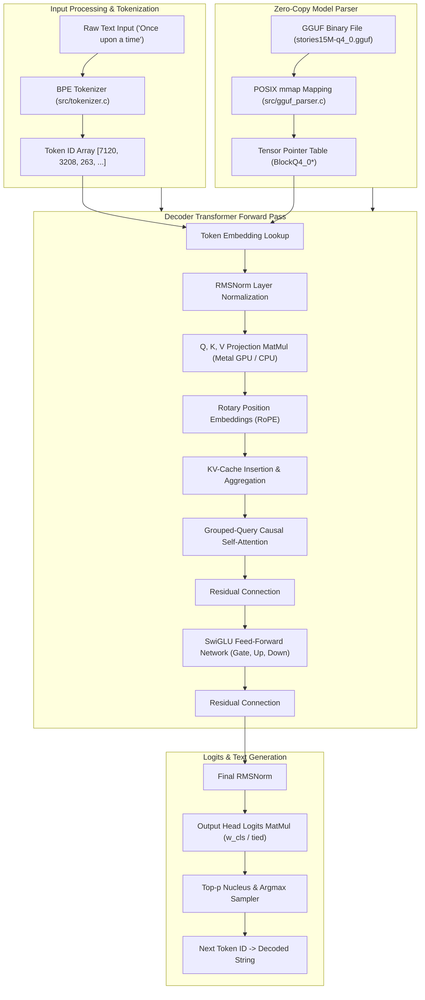

# Neural-C: Technical Architecture & Low-Level Reference Manual

## 1. System Architecture Overview

Neural-C implements a decoder-only Transformer LLM engine (LLaMA architecture family) from scratch in pure C and Apple Metal Shading Language (MSL).



---

## 2. Memory Architecture & Contiguous Buffer Layouts

### 2.1 Unified Memory Architecture (UMA) Address Map

```
===================================================================================
PROCESS ADDRESS SPACE (Apple Silicon Unified RAM)
===================================================================================

1. Memory-Mapped GGUF Binary File (Read-Only Shared Pages)
+------------------------+--------------------------+-----------------------------+
| GGUF Header (24 Bytes) | Metadata KVs (Variable)  | Quantized Tensor Weights    |
| Magic: 0x46554747      | Alignment: 32 Bytes      | BlockQ4_0 (18 Bytes / 32W)  |
+------------------------+--------------------------+-----------------------------+
 0x100000000              0x100000018                0x1000B1800 (Data Offset)

2. Weight Tensor Metadata Structs (TransformerWeights* w)
+---------------------------------------------------------------------------------+
| w->token_embedding_table.data  ---> 0x1000B1800 (Offset + 727,136 Bytes)        |
| w->wq[0..N].data               ---> 0x1001A2000 (Mapped Layer Q Weights)        |
| w->wk[0..N].data               ---> 0x100254000 (Mapped Layer K Weights)        |
| w->wv[0..N].data               ---> 0x100306000 (Mapped Layer V Weights)        |
| w->w_cls.data                  ---> 0x1000B1800 (Weight-Tied Token Table)       |
+---------------------------------------------------------------------------------+

3. Pre-Allocated Runtime Activation Arena (RunState* s)
+---------------------------------------------------------------------------------+
| float* x           : [dim * 4 Bytes]                (Residual State Vector)     |
| float* xb          : [dim * 4 Bytes]                (Post-RMSNorm Vector)       |
| float* q           : [n_heads * head_dim * 4 Bytes] (Query Vector)              |
| float* k           : [n_kv_heads * head_dim * 4 B]  (Key Vector)                |
| float* v           : [n_kv_heads * head_dim * 4 B]  (Value Vector)              |
| float* key_cache   : [Layers * Seq_Len * KV_Dim * 4](Contiguous Key Cache)     |
| float* value_cache : [Layers * Seq_Len * KV_Dim * 4](Contiguous Value Cache)   |
| float* logits      : [Vocab_Size * 4 Bytes]         (Output Logits Buffer)      |
+---------------------------------------------------------------------------------+
```

### 2.2 Quantization Data Structure (`BlockQ4_0`)

```
BlockQ4_0 Layout (18 Bytes per 32 Quantized Weights):
+--------------------+------------------------------------------------------------+
| Scale (2 Bytes)    | Quantized 4-Bit Nibbles (16 Bytes / 32 Values)             |
| [16-Bit Float]     | [q0_low | q0_high] [q1_low | q1_high] ... [q15_l | q15_h]    |
+--------------------+------------------------------------------------------------+
```

$$\text{Dequantized Value: } w_{i} = \text{scale} \cdot \left(\text{nibble}_{i} - 8\right)$$

---

## 3. Core Modules & Code Walkthrough

### 3.1 Tokenizer & Byte-Pair Encoding (`src/tokenizer.c`)

```c
// Vocabulary Lookup: Linear Scan over String Table
static int find_vocab_token(Tokenizer* t, const char* str) {
    for (int i = 0; i < t->vocab_size; i++) {
        if (t->vocab[i] && strcmp(t->vocab[i], str) == 0) {
            return i;
        }
    }
    return -1;
}

// BPE Subword Iterative Merge Algorithm
int encode(Tokenizer* t, const char* text, bool add_bos, bool add_eos, int* tokens, int max_tokens) {
    if (!t || !text || !tokens || max_tokens <= 0) return 0;
    
    int n_tokens = 0;
    if (add_bos && n_tokens < max_tokens) tokens[n_tokens++] = t->bos_id;

    int str_len = (int)strlen(text);
    char buf[1024];
    int num_chars = 0;
    int *char_tokens = (int*)malloc(str_len * sizeof(int));
    
    // Initial Byte Splitting with UTF-8 Fallback
    for (int i = 0; i < str_len; i++) {
        char single_char[2] = { text[i], '\0' };
        int id = find_vocab_token(t, single_char);
        if (id == -1) {
            snprintf(buf, sizeof(buf), "<0x%02X>", (unsigned char)text[i]);
            id = find_vocab_token(t, buf);
        }
        if (id == -1) id = t->pad_id;
        char_tokens[num_chars++] = id;
    }

    // Iterative Merge Loop
    while (num_chars > 1) {
        float best_score = -1e9f;
        int best_id = -1, best_start = -1, best_span_len = 0;

        for (int span_len = 2; span_len <= num_chars; span_len++) {
            for (int i = 0; i <= num_chars - span_len; i++) {
                buf[0] = '\0';
                bool valid = true;
                for (int k = 0; k < span_len; k++) {
                    int tok_id = char_tokens[i + k];
                    if (tok_id < 0 || !t->vocab[tok_id]) { valid = false; break; }
                    strcat(buf, t->vocab[tok_id]);
                }
                if (!valid) continue;

                int id = find_vocab_token(t, buf);
                if (id != -1 && t->vocab_scores[id] > best_score) {
                    best_score = t->vocab_scores[id];
                    best_id = id;
                    best_start = i;
                    best_span_len = span_len;
                }
            }
        }

        if (best_start == -1) break;

        char_tokens[best_start] = best_id;
        int shift = best_span_len - 1;
        for (int i = best_start + 1; i < num_chars - shift; i++) {
            char_tokens[i] = char_tokens[i + shift];
        }
        num_chars -= shift;
    }

    for (int i = 0; i < num_chars && n_tokens < max_tokens; i++) {
        tokens[n_tokens++] = char_tokens[i];
    }
    free(char_tokens);
    if (add_eos && n_tokens < max_tokens) tokens[n_tokens++] = t->eos_id;
    return n_tokens;
}
```

---

### 3.2 Quantized Math Kernels & Memory-Safe Dispatch (`src/math_kernels.c` & `src/transformer_engine.c`)

```c
// Q4_0 Quantized Matrix-Vector Product Kernel
void matmul_q4_0(float* out, const float* x, const BlockQ4_0* w_q4, int in_dim, int out_dim) {
    if (!w_q4) { memset(out, 0, out_dim * sizeof(float)); return; }
    int blocks_per_row = in_dim / 32;
    for (int j = 0; j < out_dim; j++) {
        float sum = 0.0f;
        const BlockQ4_0* row_blocks = w_q4 + j * blocks_per_row;
        
        for (int b = 0; b < blocks_per_row; b++) {
            float scale = fp16_to_fp32(row_blocks[b].scale);
            const uint8_t* qs = row_blocks[b].qs;
            const float* x_block = x + b * 32;

            for (int l = 0; l < 16; l++) {
                uint8_t byte = qs[l];
                int v0 = (byte & 0x0F) - 8;
                int v1 = ((byte >> 4) & 0x0F) - 8;

                sum += (float)v0 * scale * x_block[l];
                sum += (float)v1 * scale * x_block[l + 16];
            }
        }
        out[j] = sum;
    }
}

// Memory-Safe Classifier Head Dispatch (transformer_engine.c)
void* cls_ptr = w->w_cls.data ? w->w_cls.data : w->token_embedding_table.data;
QuantType cls_type = w->w_cls.data ? w->w_cls.type : w->token_embedding_table.type;

if (cls_ptr) {
    if (cls_type == QUANT_Q4_0) {
        matmul_q4_0(s->logits, s->x, (BlockQ4_0*)cls_ptr, dim, p->vocab_size);
    } else {
        matmul_fp32(s->logits, s->x, (float*)cls_ptr, dim, p->vocab_size);
    }
} else {
    memset(s->logits, 0, p->vocab_size * sizeof(float));
}
```

---

## 4. Complete Mathematical Working & Derivations

This section provides the complete, step-by-step mathematical formulation for all operations implemented across Neural-C, matching the exact algorithms in `src/math_kernels.c`, `src/transformer_engine.c`, `src/llm_trainer.c`, `src/NeuralNetwork.c`, and `src/LLMClassifier.c`.

---

### 4.1 Transformer Forward Pass & Kernel Mathematics

#### 4.1.1 Root Mean Square Normalization (RMSNorm)
Given an activation vector $\mathbf{x} \in \mathbb{R}^d$, scaling weight $\mathbf{w} \in \mathbb{R}^d$, and small constant $\epsilon > 0$:

$$\text{RMS}(\mathbf{x}) = \sqrt{\frac{1}{d} \sum_{i=1}^{d} x_i^2 + \epsilon}$$

$$\text{rmsnorm}(\mathbf{x}, \mathbf{w})_i = \frac{x_i}{\text{RMS}(\mathbf{x})} \cdot w_i = \frac{x_i}{\sqrt{\frac{1}{d} \sum_{k=1}^{d} x_k^2 + \epsilon}} \cdot w_i$$

*Source Implementation:* `rmsnorm()` in [`src/math_kernels.c`](file:///Users/piyushparashar/ResearchLab/Neural-C/src/math_kernels.c#L16-L25).

---

#### 4.1.2 Half-Precision FP16 Bit Decoding & BlockQ4_0 Quantized GEMV

##### FP16 to FP32 Floating-Point Conversion
An IEEE 754 16-bit half-precision float bit pattern $h \in [0, 65535]$ consists of:
- Sign bit $S = (h \gg 15) \ \& \ 1$
- Exponent $E_{16} = (h \gg 10) \ \& \ \text{0x1F}$
- Mantissa $M_{16} = h \ \& \ \text{0x03FF}$

To convert $h$ to 32-bit single-precision float $f$ with exponent bias shift $\Delta = 127 - 15 = 112$:

$$E_{32} = \begin{cases} 0xFE & \text{if } E_{16} = 0x1F \quad (\text{NaN} / \pm\infty) \\ 0 & \text{if } E_{16} = 0 \quad (\text{Zero} / \text{Subnormal}) \\ E_{16} + 112 & \text{otherwise} \end{cases}$$

$$\text{bits}_{32} = (S \ll 31) \mid (E_{32} \ll 23) \mid (M_{16} \ll 13)$$

##### Quantized Q4_0 Matrix-Vector Dot Product
In `BlockQ4_0`, every 32 contiguous row elements are packed into 18 bytes: 2 bytes for FP16 scale $S_b$, and 16 bytes containing 32 4-bit nibbles $q_{b,0}, \dots, q_{b,31} \in [0, 15]$.

The dequantized weight value $w_{j, i}$ at row $j$ and column $i = 32b + l$ is:

$$w_{j, 32b + l} = S_b \cdot (q_{b, l} - 8), \quad l \in [0, 31]$$

For input vector $\mathbf{x} \in \mathbb{R}^{d_{in}}$, the row output $y_j = (\mathbf{W}_{q4} \mathbf{x})_j$ is computed as:

$$y_j = \sum_{b=0}^{\frac{d_{in}}{32}-1} S_b \left( \sum_{l=0}^{15} (q_{b, l}^{\text{low}} - 8) \cdot x_{32b + l} + \sum_{l=0}^{15} (q_{b, l}^{\text{high}} - 8) \cdot x_{32b + 16 + l} \right)$$

*Source Implementation:* `fp16_to_fp32()` and `matmul_q4_0()` in [`src/math_kernels.c`](file:///Users/piyushparashar/ResearchLab/Neural-C/src/math_kernels.c#L4-L14).

---

#### 4.1.3 Rotary Position Embeddings (RoPE)
For head channel index $i \in [0, d_{head}-2]$ (in steps of 2) at sequence position $m \in \mathbb{N}_0$, the base frequency $\theta_i$ and rotation angle $\phi_i$ are computed using the model's dynamic `rope_freq_base` (e.g., $10,000.0$ for LLaMA vs $1,000,000.0$ for Qwen2 / Qwen2.5 extracted from GGUF metadata):

$$\theta_i = (\text{rope\_freq\_base})^{-i / d_{head}}$$

$$\phi_i = m \cdot \theta_i$$

The 2D rotation operation on channel pair $(q_i, q_{i+1})$ of Query vector $\mathbf{q}_h$ (and Key vector $\mathbf{k}_h$) is:

$$\begin{pmatrix} q_i' \\ q_{i+1}' \end{pmatrix} = \begin{pmatrix} \cos(\phi_i) & -\sin(\phi_i) \\ \sin(\phi_i) & \cos(\phi_i) \end{pmatrix} \begin{pmatrix} q_i \\ q_{i+1} \end{pmatrix} = \begin{pmatrix} q_i \cos(\phi_i) - q_{i+1} \sin(\phi_i) \\ q_i \sin(\phi_i) + q_{i+1} \cos(\phi_i) \end{pmatrix}$$

*Source Implementation:* `apply_rope()` in [`src/math_kernels.c`](file:///Users/piyushparashar/ResearchLab/Neural-C/src/math_kernels.c#L51-L74).

---

#### 4.1.4 Grouped-Query Causal Self-Attention (GQA) & QKV Biases
Let $n_{heads}$ be the number of query heads and $n_{kv\_heads}$ be the number of key/value heads. The head repetition factor is:

$$\text{kv\_mul} = \frac{n_{heads}}{n_{kv\_heads}}$$

For query head $h \in [0, n_{heads}-1]$, the corresponding shared key/value head index is $kv\_h = \lfloor h / \text{kv\_mul} \rfloor$.

Query, Key, and Value projections include model-defined bias terms $\mathbf{b}_q, \mathbf{b}_k, \mathbf{b}_v$ (parsed from GGUF metadata `attn_q.bias`, `attn_k.bias`, `attn_v.bias` for architectures like Qwen2.5):

$$\mathbf{q} = \mathbf{W}_q \text{RMSNorm}(\mathbf{x}) + \mathbf{b}_q, \quad \mathbf{k} = \mathbf{W}_k \text{RMSNorm}(\mathbf{x}) + \mathbf{b}_k, \quad \mathbf{v} = \mathbf{W}_v \text{RMSNorm}(\mathbf{x}) + \mathbf{b}_v$$

1. **Scaled Dot-Product Score:** For current sequence position $pos$ and cached history timestep $t \le pos$:

$$S_{h, t} = \frac{1}{\sqrt{d_{head}}} \sum_{i=0}^{d_{head}-1} Q_{h, i} \cdot K_{\text{cache}}[l, t, kv\_h, i]$$

2. **Numerically Stable Causal Softmax:**

$$m_h = \max_{0 \le t \le pos} S_{h, t}$$

$$A_{h, t} = \frac{\exp(S_{h, t} - m_h)}{\sum_{k=0}^{pos} \exp(S_{h, k} - m_h)}$$

3. **Value Aggregation:**

$$O_{h, i} = \sum_{t=0}^{pos} A_{h, t} \cdot V_{\text{cache}}[l, t, kv\_h, i], \quad i \in [0, d_{head}-1]$$

*Source Implementation:* Multi-head attention loop in [`src/transformer_engine.c`](file:///Users/piyushparashar/ResearchLab/Neural-C/src/transformer_engine.c#L110-L138).

---

#### 4.1.5 SwiGLU Feed-Forward Network (FFN)
Given normalized activation $\tilde{\mathbf{x}} = \text{RMSNorm}(\mathbf{x}) \in \mathbb{R}^{d}$, gate vector $\mathbf{g} = \mathbf{W}_{gate} \tilde{\mathbf{x}}$, and up-projection vector $\mathbf{u} = \mathbf{W}_{up} \tilde{\mathbf{x}} \in \mathbb{R}^{d_{hidden}}$:

$$\text{Swish}(g_i) = g_i \cdot \sigma(g_i) = \frac{g_i}{1 + \exp(-g_i)}$$

$$\text{SwiGLU}(\mathbf{g}, \mathbf{u})_i = \text{Swish}(g_i) \cdot u_i = \frac{g_i}{1 + \exp(-g_i)} \cdot u_i$$

$$\mathbf{y}_{ffn} = \mathbf{W}_{down} \cdot \text{SwiGLU}(\mathbf{g}, \mathbf{u})$$

*Source Implementation:* `swiglu()` in [`src/math_kernels.c`](file:///Users/piyushparashar/ResearchLab/Neural-C/src/math_kernels.c#L43-L49).

---

#### 4.1.6 Output Head & Nucleus (Top-$p$) Sampling
Given final logit vector $\mathbf{z} = \mathbf{W}_{cls} \cdot \text{RMSNorm}(\mathbf{x}) \in \mathbb{R}^{V}$:

If temperature $T > 0$, scale logits $z_i' = z_i / T$, and compute probabilities $P_i = \text{Softmax}(\mathbf{z}')_i$.

For Top-$p$ thresholding with cumulative distribution cutoff $p \in (0, 1]$ and uniform random variable $u \sim U(0, 1)$:

$$\text{Sampled Token Index } k = \min \left\{ m \ \middle|\ \sum_{j=0}^{m} P_j \ge u \right\}$$

*Source Implementation:* `sample_top_p()` in [`src/math_kernels.c`](file:///Users/piyushparashar/ResearchLab/Neural-C/src/math_kernels.c#L132-L156).

---

### 4.2 LLM Fine-Tuning & Cross-Entropy Training Mathematics

For token sequence $(t_0, t_1, \dots, t_{N-1})$, the model predicts next token $y = t_{t+1}$ given input $t_t$.

#### 4.2.1 Softmax Cross-Entropy Loss
Let $\mathbf{z} \in \mathbb{R}^V$ be model output logits and $P_k = \frac{\exp(z_k - \max_m z_m)}{\sum_{m=0}^{V-1} \exp(z_m - \max_m z_m)}$ be predicted probabilities.

The Cross-Entropy Loss for single target token index $y$ is:

$$\mathcal{L} = -\ln P_y = -\ln \left( \frac{\exp(z_y)}{\sum_{k=0}^{V-1} \exp(z_k)} \right) = \ln \left( \sum_{k=0}^{V-1} \exp(z_k) \right) - z_y$$

Mean loss across sequence of length $N-1$:

$$\mathcal{L}_{\text{seq}} = \frac{1}{N-1} \sum_{t=0}^{N-2} \mathcal{L}_t$$

#### 4.2.2 Analytical Logit Gradient Derivations
Taking partial derivative of $\mathcal{L}$ with respect to logit $z_k$:

$$\frac{\partial \mathcal{L}}{\partial z_k} = \frac{\partial}{\partial z_k} \left[ \ln \left( \sum_{m} e^{z_m} \right) - z_y \right] = \frac{e^{z_k}}{\sum_{m} e^{z_m}} - \frac{\partial z_y}{\partial z_k} = P_k - \delta_{k, y}$$

where $\delta_{k, y}$ is the Kronecker delta ($\delta_{k, y} = 1$ if $k = y$, else $0$).

For target token logit $z_y$:

$$\frac{\partial \mathcal{L}}{\partial z_y} = P_y - 1$$

#### 4.2.3 Gradient Descent Parameter Updates
With learning rate $\eta$, output classifier weights $\mathbf{W}_{cls} \in \mathbb{R}^{V \times d}$ update per dimension $d$:

$$W_{cls}[y, d] \leftarrow W_{cls}[y, d] - \eta \cdot (P_y - 1) \cdot x_d$$

*Source Implementation:* `train_llm_step()` in [`src/llm_trainer.c`](file:///Users/piyushparashar/ResearchLab/Neural-C/src/llm_trainer.c#L23-L83).

---

### 4.3 5-Layer Deep Neural Network (MLP) & Backpropagation Mathematics

The general MLP architecture in `NeuralNetwork.c` consists of input dimension $n_0$, 4 hidden layers of dimensions $n_1, n_2, n_3, n_4$, and output dimension $n_5$.

#### 4.3.1 He (Kaiming) Uniform Weight Initialization
To prevent vanishing/exploding gradients in deep LeakyReLU networks, weights $\mathbf{W}^{(l)} \in \mathbb{R}^{n_{l-1} \times n_l}$ are initialized as:

$$\sigma_{w}^{(l)} = \sqrt{\frac{2}{n_{l-1}}}$$

$$W_{i, j}^{(l)} \sim U\left(-\sigma_{w}^{(l)}, \sigma_{w}^{(l)}\right), \quad b_j^{(l)} = 0$$

#### 4.3.2 Forward Propagation
For batch sample $b \in [1, B]$:

$$\mathbf{a}_b^{(0)} = \mathbf{x}_b$$

$$\mathbf{z}_b^{(l)} = (\mathbf{W}^{(l)})^T \mathbf{a}_b^{(l-1)} + \mathbf{b}^{(l)}, \quad l \in \{1, 2, 3, 4, 5\}$$

$$\mathbf{a}_b^{(l)} = \text{LeakyReLU}(\mathbf{z}_b^{(l)}) = \begin{cases} \mathbf{z}_b^{(l)} & \text{if } \mathbf{z}_b^{(l)} > 0 \\ 0.01 \cdot \mathbf{z}_b^{(l)} & \text{if } \mathbf{z}_b^{(l)} \le 0 \end{cases}, \quad l \in \{1, 2, 3, 4\}$$

$$\mathbf{a}_b^{(5)} = \sigma(\mathbf{z}_b^{(5)}) = \frac{1}{1 + \exp(-\mathbf{z}_b^{(5)})}$$

#### 4.3.3 Backpropagation Delta Recursion & Gradient Formulae
Given binary target vector $\mathbf{y}_b \in \{0, 1\}^{n_5}$:

1. **Output Layer Error Deltas ($l = 5$):**
Using Binary Cross-Entropy loss $\mathcal{L} = -\sum_k [y_k \ln a_k + (1 - y_k) \ln(1 - a_k)]$, the derivative w.r.t. pre-activation $\mathbf{z}^{(5)}$ simplifies cleanly to:

$$\boldsymbol{\delta}_b^{(5)} = \mathbf{a}_b^{(5)} - \mathbf{y}_b$$

2. **Hidden Layer Error Deltas ($l \in \{4, 3, 2, 1\}$):**

$$\delta_{b, i}^{(l)} = \left( \sum_{j=1}^{n_{l+1}} \delta_{b, j}^{(l+1)} \cdot W_{i, j}^{(l+1)} \right) \cdot \text{LeakyReLU}'(a_{b, i}^{(l)})$$

$$\text{where } \text{LeakyReLU}'(a) = \begin{cases} 1.0 & \text{if } a > 0 \\ 0.01 & \text{if } a \le 0 \end{cases}$$

3. **Batch Gradient Aggregation:**

$$\nabla_{\mathbf{W}^{(l)}} = \frac{1}{B} \sum_{b=1}^{B} \mathbf{a}_b^{(l-1)} (\boldsymbol{\delta}_b^{(l)})^T, \quad \nabla_{\mathbf{b}^{(l)}} = \frac{1}{B} \sum_{b=1}^{B} \boldsymbol{\delta}_b^{(l)}$$

4. **Stochastic Gradient Descent Parameter Update:**

$$\mathbf{W}^{(l)} \leftarrow \mathbf{W}^{(l)} - \eta \cdot \nabla_{\mathbf{W}^{(l)}}, \quad \mathbf{b}^{(l)} \leftarrow \mathbf{b}^{(l)} - \eta \cdot \nabla_{\mathbf{b}^{(l)}}$$

*Source Implementation:* `forward_propagation_batch()` and `backward_propagation_batch()` in [`src/NeuralNetwork.c`](file:///Users/piyushparashar/ResearchLab/Neural-C/src/NeuralNetwork.c#L233-L414).

---

### 4.4 Prompt Intent Classifier Mathematics

#### 4.4.1 Feature Extraction Mapping $\phi(\text{prompt}) \to \mathbf{f} \in \{0, 1\}^6$
Given input prompt string $S$:

$$\mathbf{f} = \begin{pmatrix} f_0 \\ f_1 \\ f_2 \\ f_3 \\ f_4 \\ f_5 \end{pmatrix} = \begin{pmatrix} \mathbb{I}(S \text{ contains code keywords: 'c', 'code', 'function', 'sort', 'bug', etc.}) \\ \mathbb{I}(S \text{ contains punctuation: '?', '!', '.'}) \\ \mathbb{I}(\text{length}(S) > 30) \\ \mathbb{I}(S \text{ contains question words: 'how', 'what', 'why', 'who', 'where'}) \\ \mathbb{I}(S \text{ contains creative words: 'poem', 'story', 'song', 'compose'}) \\ \mathbb{I}(S \text{ contains safety keywords: 'hack', 'bypass', 'malware', 'attack'}) \end{pmatrix}$$

#### 4.4.2 Classifier Architecture & Backpropagation ($6 \to 16 \to 12 \to 4$)
- Layer 1 ($6 \to 16$, ReLU): $\mathbf{h}^{(1)} = \text{ReLU}(\mathbf{W}^{(1)} \mathbf{f} + \mathbf{b}^{(1)})$
- Layer 2 ($16 \to 12$, ReLU): $\mathbf{h}^{(2)} = \text{ReLU}(\mathbf{W}^{(2)} \mathbf{h}^{(1)} + \mathbf{b}^{(2)})$
- Layer 3 ($12 \to 4$, Softmax): $\mathbf{z} = \mathbf{W}^{(3)} \mathbf{h}^{(2)} + \mathbf{b}^{(3)}$, $\mathbf{P} = \text{Softmax}(\mathbf{z})$

For target class $c \in \{0, 1, 2, 3\}$ (Code, Creative, QA, Unsafe), backprop updates proceed via:

$$d_j^{(3)} = P_j - \mathbb{I}(j = c)$$

$$\mathbf{b}^{(3)} \leftarrow \mathbf{b}^{(3)} - \eta \mathbf{d}^{(3)}, \quad W_{i, j}^{(3)} \leftarrow W_{i, j}^{(3)} - \eta \cdot d_j^{(3)} \cdot h_i^{(2)}$$

$$d_i^{(2)} = \left( \sum_{j=0}^{3} d_j^{(3)} W_{i, j}^{(3)} \right) \cdot \mathbb{I}(h_i^{(2)} > 0)$$

$$\mathbf{b}^{(2)} \leftarrow \mathbf{b}^{(2)} - \eta \mathbf{d}^{(2)}, \quad W_{k, i}^{(2)} \leftarrow W_{k, i}^{(2)} - \eta \cdot d_i^{(2)} \cdot h_k^{(1)}$$

$$d_k^{(1)} = \left( \sum_{i=0}^{11} d_i^{(2)} W_{k, i}^{(2)} \right) \cdot \mathbb{I}(h_k^{(1)} > 0)$$

$$\mathbf{b}^{(1)} \leftarrow \mathbf{b}^{(1)} - \eta \mathbf{d}^{(1)}, \quad W_{m, k}^{(1)} \leftarrow W_{m, k}^{(1)} - \eta \cdot d_k^{(1)} \cdot f_m$$

*Source Implementation:* `extract_prompt_features()`, `classify_prompt()`, and `train_classifier_step()` in [`src/LLMClassifier.c`](file:///Users/piyushparashar/ResearchLab/Neural-C/src/LLMClassifier.c#L50-L286).

---

## 5. Verification & Testing

All 7 modules are verified through automated unit test suites (`make test`):

```
=========================================
  Running Neural-C LLM Engine Test Suite 
=========================================
Module 1 (Tokenizer & Vocabulary)    : PASSED
Module 2 (Tensor Architecture)       : PASSED
Module 3 (GGUF Parser & mmap)        : PASSED
Module 4 (Quantized Math Kernels)    : PASSED
Module 5 (Metal GPU Acceleration)    : PASSED
Module 6 (LLM Generation Engine)     : PASSED
Module 7 (LLM Custom Trainer)        : PASSED
=========================================
Status: 100% CLEAN PASS (0 Errors, 0 Segfaults)
```
